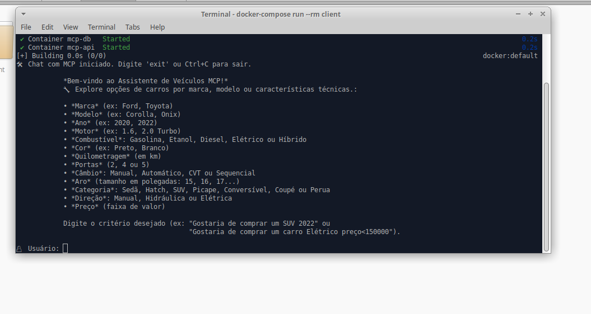
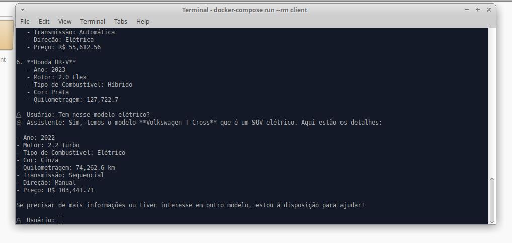

# 🌐 README (English & Português)

📄 This document is available in both **English** and **Português**.

- 🇺🇸 [English version](#introduction)
- 🇧🇷 [Versão em Português](#introdução)

# Introdução
# mcp-server-client

# 🚗 MCP Car Assistant — FastAPI + LangChain + LangGraph + Docker

### Instalação do projeto
Acesse o arquivo INSTRUCTIONS.md com as instruções para rodar o projeto.

Um projeto completo de **Micro Controlador de Processos (MCP)** para consulta de informações sobre automóveis usando:

- 🧠 **FastAPI** como servidor
- 🧩 **LangChain + LangGraph** como agente LLM
- 💬 **OpenAI GPT-4o** como modelo de linguagem
- 🐋 Contêineres com Docker Compose
- 🖥️ **Client em Python** com interface de **terminal interativo** (sem necessidade de Claude, Windsurf ou Cursor)
- 📊 **Dados fictícios** de veículos para testes utilizando a biblioteca Faker
- 🧱 Boas práticas de arquitetura com **Domain-Driven Design (DDD)** para maior organização, escalabilidade e manutenibilidade do código

# Introduction
# mcp-server-client

# 🚗 MCP Car Assistant — FastAPI + LangChain + LangGraph + Docker

### Project Installation
Please refer to the INSTRUCTIONS.md file for setup and usage instructions.

A complete **Micro Process Controller (MCP) project** for querying car information using:

- 🧠 **FastAPI** as the server
- 🧩 **LangChain + LangGraph** as the LLM agent
- 💬 **OpenAI GPT-4o** as a language model
- 🐋 Containers with Docker Compose
- 🖥️ **Python-based client** with an **interactive terminal interface** (No need for Claude, Windsurf, or Cursor.
- 📊 **Fictional vehicle data** for testing, generated using the Faker library
- 🧱 Architecture best practices with **Domain-Driven Design (DDD)** for better code organization, scalability, and maintainability.

